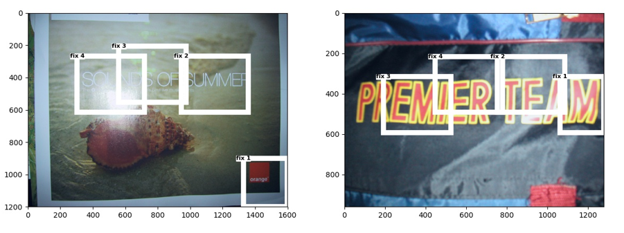
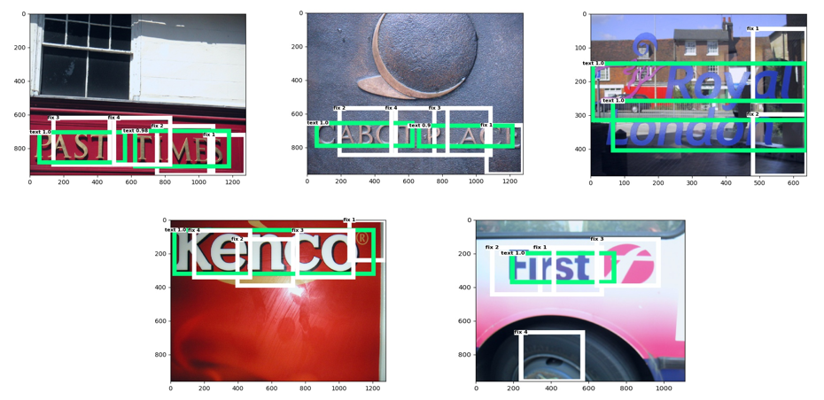
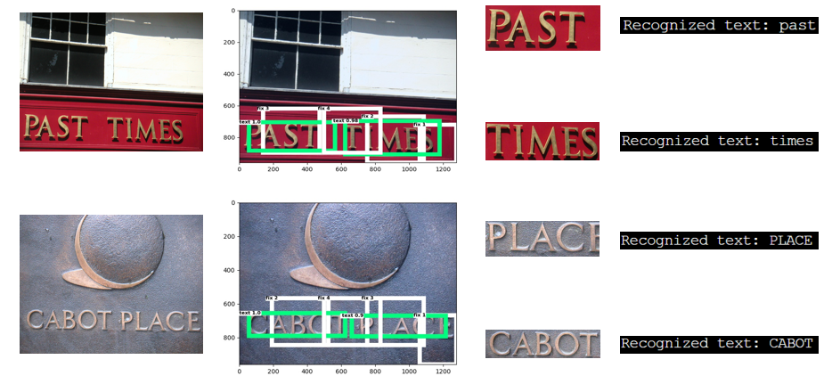
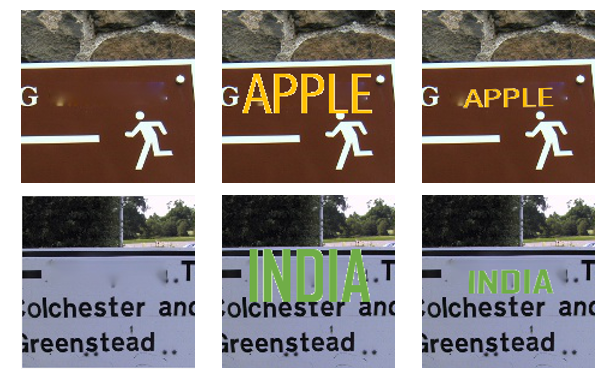

# OCR with deep reinforcement learning-EECS495

## Text-drl
1. We utilize codes from the following link and change some components like the network structure and network configurations to adapt to the text detection task. 
https://github.com/aleksispi/drl-rpn-tf

2. If you want to train this model, please download the dataset from ICDAR 2013 and put it into "data" folder.

3. Here is the pretrained faster-rcnn model: https://drive.google.com/file/d/1rbni8OvXIX7YBEY-zkXuqZVcniTrvhqG/view?usp=sharing, you can use it to initialize text-drl vgg-16 backbone parameters.

4. For training part, the main script to launch is experiments/scripts/train_drl_rpn.sh. Setup SAVE_PATH and WEIGHT_PATH appropriately, and run the command ./experiments/scripts/train_drl_rpn.sh

5. For testing part, run ./experiments/scripts/test_drl_rpn.sh

Here is the Attention Result:

Here is the Detection Result:

## Recognizer Part
1. we directly use the recognizer part from the ASTER: Attentional Scene Text Recognizer with Flexible Rectification, please check the link on how to modify and use their codes.
https://github.com/bgshih/aster

Here is the Recognition Result:

## STGAN
1. This part is for generating "real" text images. Codes are modified from this link: https://github.com/chenhsuanlin/spatial-transformer-GAN

2. We use ICDAR 2013, 2015, SVT to train this network, you can download the datasets from their websites. Firstly, we crop image into small patches for each words and record their text content from ground truth. Then, we treat each patch as real image and text content as foreground. After that, we smooth out text in real image served as background. After this, you can use the preprocess python files to generate corresponding .npy files.

3. To train, you can run ./train.sh; To evaluate, you can run ./test.sh

Here is the Synthesis Result:

